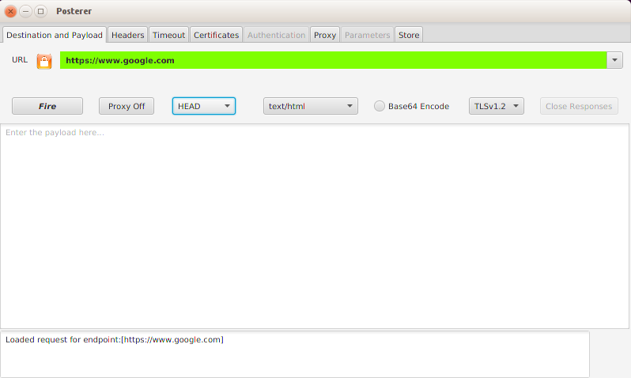

# Posterer #

Posterer is a JavaFX application to manage and send data to HTTP-based services such as SOAP and REST.

## Table of Contents ##

- [Posterer's Origins](#posterers-origins)
- [Installation ](#installation)
- [Design Decisions ](#design-decisions)
- [License](#license)

## Posterer's Origins ##

It's handy to have an app that you can use to fire off HTTP transactions at services - Like a web browser for example. But browsers are driven by HTML, and for testing Web Services (i.e. SOAP) you need finer grain control. On Firefox, there is the _Poster_ plug-in. I've used this a lot and it's been very useful. 

As the number and the authentication and authorization requirements for hitting web services increase, _Poster_ is showing it's age. I need more power at my finger tips, so I am writing a poster-er. And here it is. _Posterer_.

Some feature:
* Store end-points and payloads
* Asynchronous requests
* Proxy control
* Call statistics
* Full headers
* Crypto controls

## Installation ##

_Posterer_ requires _JavaFX 8_, and therefore _Java 8_. There's plenty of people still on Java 7 - To use _Posterer_ along-side a Java 7 installation I recommend an off-line, silent, installation of Java 8 in a user-managed directory, say, _/opt/java/java8_:

	<java8-install-exe> /s INSTALLDIR=/opt/java/java8

## Design Decisions ##

The main decision has been the choice of _JavaFX 8_ (and Java 8) over _JavaFX 2.2_ (and Java 7). JavaFX 8 adds more useful features to the basic core JavaFX objects, plus some functional programming features of Java 8. 

Given that there are many options to provide the HTTP transport framework (and perhaps other network protocols and transports), Google _Guice_ was chosen to provide lightweight IOC to minimize linkage. Initially, _Posterer_ comes with _Apache HTTP client_. 

## License ##

Posterer - Copyright 2015 technosf [https://github.com/technosf]

Licensed under the Apache License, Version 2.0 (the "License");
you may not use this file except in compliance with the License.
You may obtain a copy of the License at

	http://www.apache.org/licenses/LICENSE-2.0

Unless required by applicable law or agreed to in writing, software
distributed under the License is distributed on an "AS IS" BASIS,
WITHOUT WARRANTIES OR CONDITIONS OF ANY KIND, either express or implied.
See the License for the specific language governing permissions and
limitations under the License.